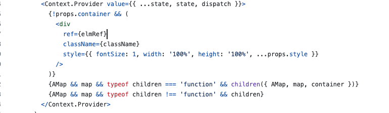

# 地图的异步加载同步化

目的：减少使用者对地图异步加载的心智负担


由于使用地图必须等待地图的sdk加载完再初始化，所以地图的初始化必定是异步的。


通常的做法是在加载地图sdk的promise完成后，在then回调里面处理。

那么就导致一个问题，所有的地图相关操作都需要写在then的回调内，难以维护和封装。


得益于hooks的出现，我们现在会把初始化地图的方法封装成一个hooks(useMap)，抛出地图实例和地图是否初始化的状态，使用时通过监听地图状态来操作地图。

但是这种方法还是不够好，在实际项目中，需要去等待接口数据的返回和地图的初始化，这两个异步使得编写代码逻辑变得困难。


### 开源库的做法

参考库：

react-amap:<https://github.com/uiwjs/react-amap>

Vue3 BaiduMap GL:<https://github.com/yue1123/vue3-baidu-map-gl>

他们的做法都是将地图和覆盖物做成组件

```jsx
<Map>
  <Polygon />
</Map>
```

Map组件将地图状态传递给子组件，子组件依赖地图状态去执行自身的init初始化方法。

为什么说是依赖呢，因为两个库的做法各不相同

### React

Map:



Marker:


react将地图状态通过provider自Map组件往下传递，覆盖物作为子组件使用useEffect去监听地图状态变化，待地图初始化完成后再执行自己的init方法。


### Vue

Vue库的作者方法比较绕，他是使用订阅发布的模式去实现的，但是原理是跟react的差不多。


核心都是地图初始化完成回调子组件init方法，本质区别不大，监听也可以看作订阅的一种实现，自动挡的订阅(不需要emit)。

### 数据可视化大屏和一般后台项目的区别

- 地图的状态

   每个地图都需要一个div容器去初始化，div又是依赖于页面的，一般后台项目需要频繁切换页面，也导致了地图的频繁销毁和创建。而数据可视化大屏的地图是不会频繁地去销毁和创建的，所以很少需要顾虑地图状态。

- 地图覆盖物的管理

   标签化、组件化的覆盖物预设性是很强的，导致要新增什么覆盖物之前，你就要在Map组件里写好覆盖物组件，很蠢的做法。数据可视化大屏自身的项目特点就注定了对地图的操作是灵活多变的。

   通常，在数据可视化大屏中，为了降低组件的通信成本，首先把地图应用中需要频繁通信的数据提升为所有组件都可以访问的状态，比如：地图、图层、全局业务数据等的访问与设置。对于组件之间太频繁的通信，通过封装通信 hooks 的方式，来实现组件之间状态的访问与设置。
